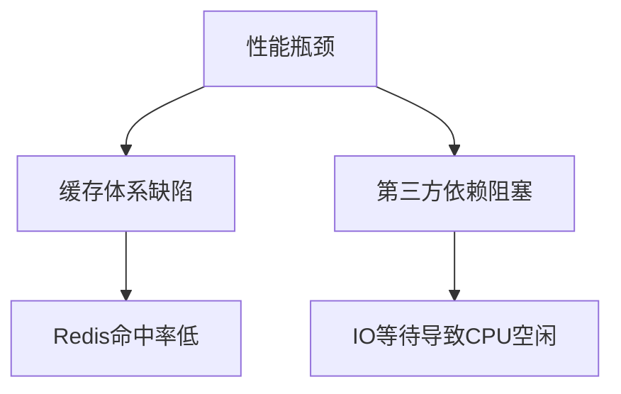
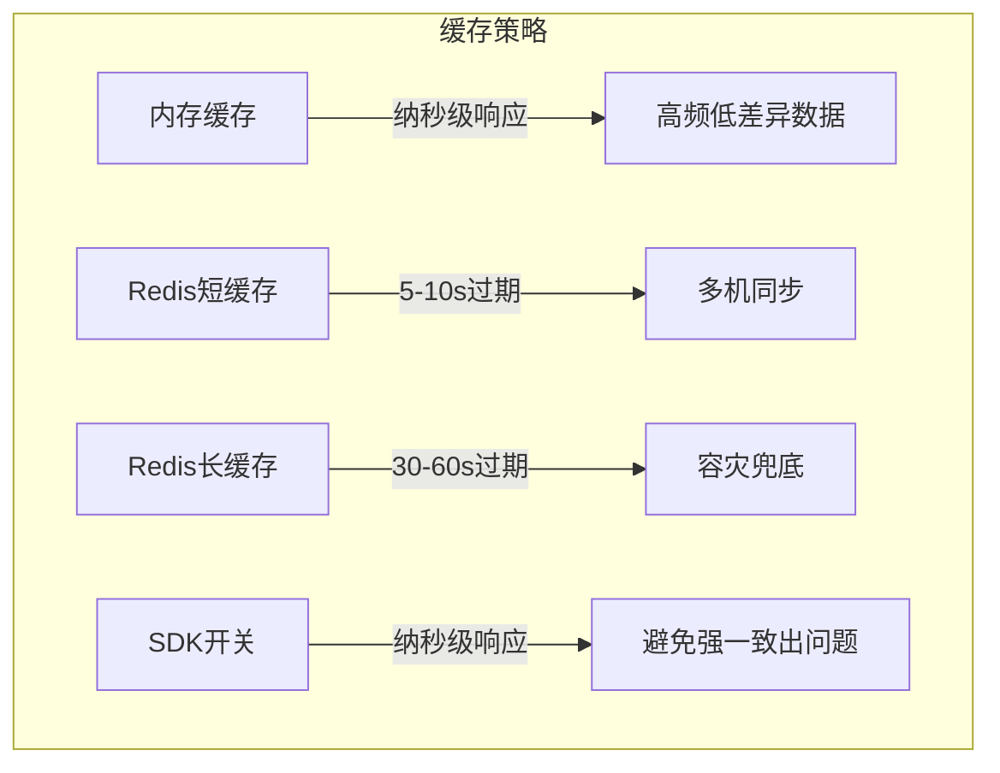
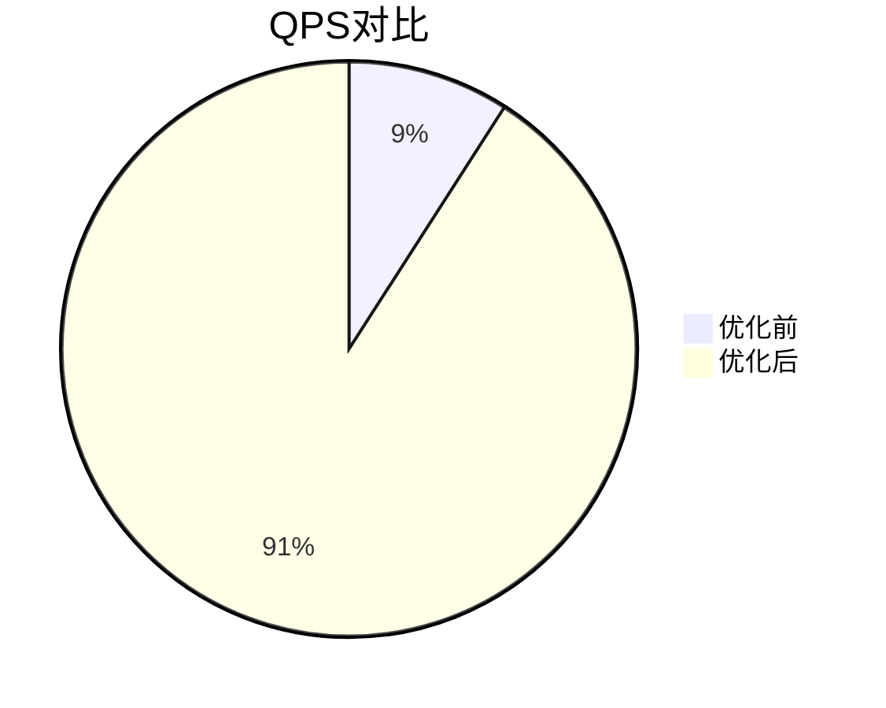
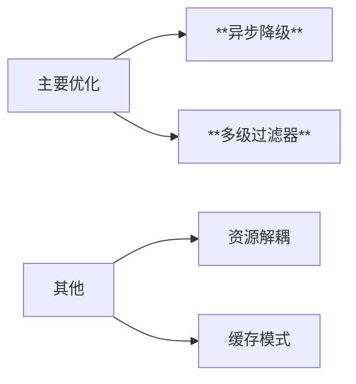

# 高并发登录业务优化方案

## 一、问题与背景分析

### 1.1 业务痛点
- **瞬时流量冲击**：突发流量导致系统过载
- **CPU利用率异常**：峰值时CPU使用率<30%
- **原始业务流程**：

  ```mermaid
  graph LR
    A[用户登录] --> B[服务端] --> C[第三方认证] --> D[MySQL写入] --> E[返回用户] --> F[更新Redis]

### 1.2 性能瓶颈

| 指标            | 优化前    | 优化后    |
| :-------------- | :-------- | :-------- |
| **QPS**         | 4,000     | 40,000+   |
| **Redis命中率** | <20%      | >90%      |
| **响应延迟**    | 50ms-1.5s | 5µs-200ms |


## 二、根因定位与解决方案

### 2.1 核心问题分析



### 2.2 多级缓存



先偷个懒，直接把网关组件搬过来：

### 2.3 综合治理

继续分析发现是命中率低的原因和瓶颈都是第三方延迟很高，IO都在等待第三方返回，所以CPU占用率不高，新的优化逻辑：

- ❌ 淘汰方案：考虑了布隆过滤器、主动预热缓存、合并第三方请求，都不太合适
- ✅**White-Through模式**：先更新Redis后响应客户端，提示二次命中率
- ✅**异步降级重试**：
    - **超时拦截**：100ms快速失败
    - **异步队列**：队列异步处理，提示二次请求命中率
- ⚡**多级过滤器**：自己设计了一个多级拦截功能


### 2.4 MySql优化

| 优化措施     | 实现方式         | 效果             |
| :----------- | :--------------- | :--------------- |
| Singleflight | 批量合并写入请求 | 写操作减少90%    |
| 读写隔离     | 新增只读库       | mysql延迟降低50% |

## 三、实施效果验证

### 3.1 性能提升



### 3.2 其他优化考虑：

- **被动降级**：第三方故障时切换长缓存
- **弹性扩容**：动态调整消费队列数量
- 主要是qps够用了，这些加入feature吧


## 四、总结

> **总结**：通过牺牲部分可靠性换取性能提升，主要原因还是第三方性能太差了


